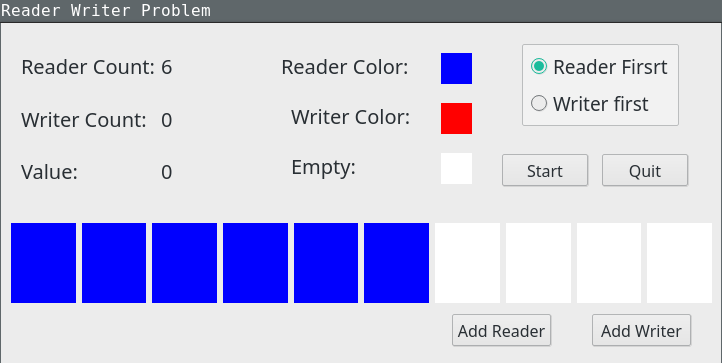

## Reader Writer Problem

Qt Implementation for visual demenstration of reader writer problem,
which provides reader-first mode and writer-first mode.

- image



- console output example

```
reader  1  start to read...
reader  2  start to read...
reader  3  start to read...
reader  3  read value:  0
reader  2  read value:  0
reader  1  read value:  0
writer  1  start to write...
writer  1  write value:  4
writer  1  start to write...
writer  1  write value:  7
```

